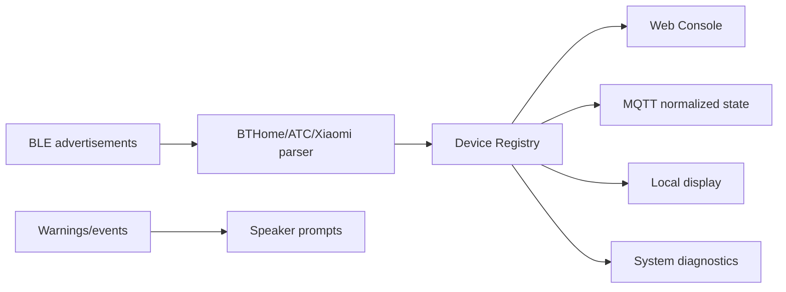

# TigerOS Hardware UI and Audio Plan

## Target Board

Freenove ESP32-S3 media/camera kit class hardware:

- ESP32-S3
- 3.5 inch display
- Camera
- Dual speakers
- Dual microphones
- WiFi/BLE
- Optional PSRAM

Exact LCD, touch, camera, I2S, and amplifier pins must be confirmed from the Freenove board tutorial or schematic before enabling drivers.

## Product Direction

TigerOS should stay a lightweight gateway first. The screen and audio should make the gateway easier to use locally, not turn the ESP32-S3 into a heavy server.

Recommended local features:

- Setup QR code and LAN IP display
- WiFi/MQTT/BLE/Cloud status screen
- Child device count and latest sensor values
- OTA progress and success/failure result
- Factory reset confirmation screen
- Short audio prompts for setup, online, offline, OTA complete, and alerts
- Optional camera snapshot page later, only if memory budget allows

## Display Architecture

Use ESP-IDF native display components:

- `esp_lcd`
- panel driver matching the Freenove LCD controller
- optional `lvgl` if UI complexity grows

## Current Firmware State

TigerOS `1.0.14-hardware-foundation` enables the safe hardware foundation:

- `/api/hardware` reports Freenove Media Kit board status.
- `/api/hardware/display` controls the TFT backlight through GPIO20.
- `/api/hardware/beep` accepts audio test requests and writes a diagnostic log entry.
- Web Console has a Hardware tab for display/audio/camera/microphone status.
- Native ST7796 pixel output, I2S audio, microphone capture, camera capture, and LVGL are still gated until exact pin mapping is confirmed.

Known Freenove references used so far:

- 3.5 inch model resolution: 320x480.
- Display controller family in tutorial/product docs: ST7365/ST7796.
- TFT backlight pin in official example: GPIO20.
- SD card pins in official example: CMD GPIO38, CLK GPIO39, D0 GPIO40.

Suggested screens:

1. Boot
   - TigerOS logo
   - firmware version
   - heap/PSRAM state

2. Network
   - setup AP SSID
   - LAN IP
   - QR code for Web Console URL

3. Devices
   - paired device count
   - latest temperature/humidity/battery summary
   - warning when no recent BLE packets are received

4. Diagnostics
   - WiFi RSSI
   - MQTT state
   - BLE scan state
   - free heap
   - last error line

5. OTA
   - upload/download progress
   - rollback pending/valid state

## Audio Architecture

Use ESP-IDF native I2S audio:

- `driver/i2s_std.h` for speaker output
- `driver/i2s_pdm.h` or board-specific microphone path if the microphones are PDM
- keep audio assets short and stored compressed or generated as simple tones

Recommended V1 audio events:

- setup mode started
- WiFi connected
- WiFi disconnected
- MQTT connected
- OTA started
- OTA success
- OTA failed
- child device offline

Avoid always-on voice assistant features in the gateway baseline. They are memory and CPU heavy and should be optional.

## BLE Gateway Optimization

Because the board is always powered, BLE scanning can use a high duty cycle:

- scan window: 15 seconds
- scan cycle: 16 seconds
- passive scanning by default

This is close to continuous scanning while still giving the BLE/WiFi coexistence layer recovery space.

If WiFi throughput or OTA reliability suffers, add a user setting:

- balanced: 5s scan / 30s cycle
- gateway: 15s scan / 16s cycle
- quiet: manual scan only

## Data Flow

## Implementation Phases

### Phase 1

- Full system diagnostics tab
- high duty BLE scan mode
- display/audio plan only

### Phase 2

- board pin mapping
- LCD driver bring-up
- status screen
- QR code for Web Console

### Phase 3

- I2S speaker driver
- simple tone/audio prompt service
- event-to-audio mapping

### Phase 4

- microphone/camera experiments
- optional voice assistant integration
- optional local snapshot endpoint

## Risks

- LCD, camera, BLE, WiFi, and OTA together can stress heap if PSRAM is not enabled.
- Continuous BLE scanning can reduce WiFi throughput.
- Audio and camera drivers are board-specific and should not be enabled until pins are verified.
- Voice assistant workloads should remain optional.
